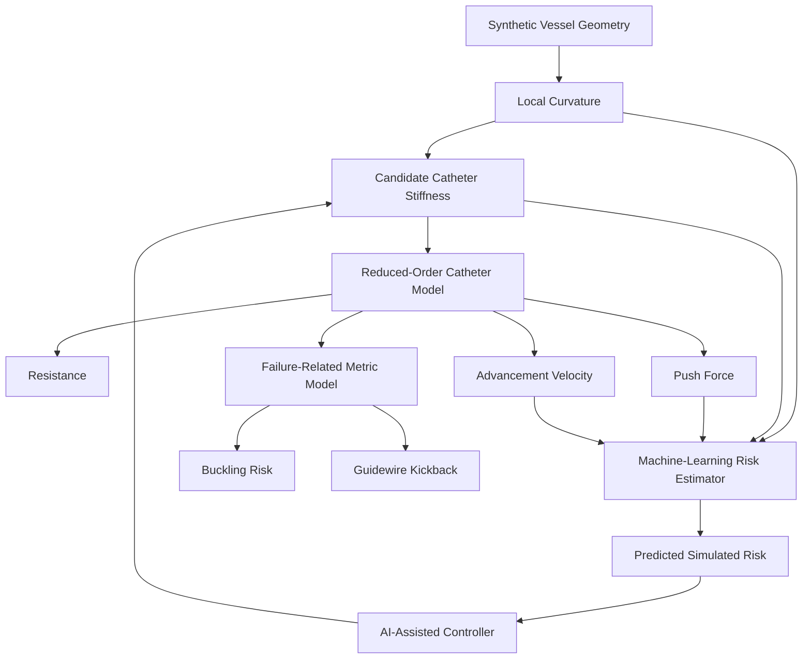

# Adaptive Catheter Stiffness Control

A computational biomedical engineering R&D project exploring whether dynamically adjustable catheter stiffness can improve navigation through tortuous vessel geometries.

The project combines a reduced-order catheter digital twin, synthetic vessel generation, rule-based control, machine-learning risk estimation, and model-based adaptive stiffness control.

> **Important:** This is a synthetic computational study. The models and normalized risk metrics are not clinically validated and should not be interpreted as predictions of real patient or device outcomes.

---

## Project Motivation

A catheter that is too flexible may lack pushability and structural support, while a catheter that is too stiff may experience greater resistance or unfavorable mechanical behavior in curved anatomy.

This project investigates the engineering question:

**Can catheter stiffness be adjusted along a vessel to balance navigation performance and simulated mechanical risk?**

The development process progressed from fixed-stiffness baselines to rule-based adaptive controllers and finally to an AI-assisted, rate-limited model-based controller.

---

## System Architecture



At each vessel location, the final controller:

1. Calculates local vessel curvature.
2. Evaluates candidate catheter stiffness values.
3. Uses the digital twin to estimate the resulting mechanical response.
4. Uses a trained Random Forest to estimate simulated navigation risk.
5. Selects the lowest-risk reachable stiffness.
6. Applies a rate limit to prevent unrealistically large stiffness changes between simulation steps.

---

## Digital Twin

### Vessel Geometry

Synthetic 2D vessel centerlines are generated at three difficulty levels:

- Easy
- Moderate
- Severe

Local curvature is calculated numerically along each vessel centerline.

The randomized generator uses fixed seeds when reproducibility is required, allowing identical vessel geometries to be recreated for controlled experiments.

### Catheter Mechanics

The reduced-order catheter model uses inputs including:

- vessel curvature
- catheter stiffness
- friction
- commanded velocity
- baseline insertion force

The model estimates:

- navigation resistance
- proximal push force
- catheter advancement velocity

The model is intended for comparative engineering studies rather than high-fidelity structural or clinical prediction.

### Failure-Related Metrics

Two normalized synthetic metrics are calculated:

- buckling risk
- guidewire kickback score

A combined simulated navigation-risk metric is defined from these outputs.

These quantities are engineering comparison scores between `0` and `1`; they are **not probabilities of device failure or patient injury**.

---

## Controller Development

The project evaluates several stiffness-control strategies.

### Fixed Stiffness

Three fixed configurations establish baseline performance:

- Flexible
- Medium
- Stiff

These simulations demonstrated the core design tradeoff: no single fixed stiffness performs best across every vessel condition.

### Adaptive V1

A rule-based controller adjusts stiffness using local curvature and mechanical feedback.

Typical behavior:

- straighter regions permit greater stiffness
- higher-curvature regions favor greater flexibility

### Balanced V2

A second rule-based controller introduces more conservative stiffness behavior to balance flexibility, support, and mechanical response.

### AI-Assisted Controller

The AI-assisted controller does **not** directly predict catheter stiffness.

Instead, for each candidate stiffness it:

1. simulates the resulting catheter state,
2. predicts the associated simulated risk using a Random Forest,
3. compares all candidate predictions,
4. selects the candidate with the lowest estimated risk.

The candidate stiffness range is:

`0.10` to `0.90` in increments of `0.05`.

This makes the final system an **AI-assisted model-based controller** rather than an end-to-end neural controller.

### Rate-Limited AI Controller

The unconstrained AI may request large stiffness changes between adjacent simulation points.

A rate-limited version was therefore implemented to restrict the change in commanded stiffness.

A sensitivity study evaluated maximum stiffness changes of:

- `0.05`
- `0.10`
- `0.15`
- `0.20`
- `0.80`

A final limit of **0.10 stiffness units per simulation step** was selected because increasing the limit beyond this value produced only marginal improvement in average simulated risk while allowing substantially greater controller activity.

This is a computational control constraint and has not been calibrated to a physical variable-stiffness actuator or real time constant.

---

## Machine-Learning Pipeline

### Synthetic Dataset

The digital twin was used to generate:

- **60,000 total samples**
- **300 unique synthetic vessels**
- 100 easy vessels
- 100 moderate vessels
- 100 severe vessels
- 200 sampled positions per vessel

The data were split by **entire vessel**, rather than randomly splitting individual rows, to prevent samples from the same geometry appearing in both training and evaluation sets.

| Split | Vessels | Samples |
|---|---:|---:|
| Training | 210 | 42,000 |
| Validation | 45 | 9,000 |
| Final Test | 45 | 9,000 |

### Features

The Random Forest risk estimator uses:

- local curvature
- current catheter stiffness
- push force
- advancement velocity

Target:

- simulated combined navigation risk

### Model Comparison

Linear Regression was used as a simple baseline and compared with a Random Forest regressor.

The Random Forest achieved substantially lower validation error and was selected as the final surrogate model.

### Final Held-Out Test Performance

The frozen Random Forest was evaluated on the previously untouched 45-vessel test set:

| Metric | Final Test Result |
|---|---:|
| MAE | **0.0089** |
| RMSE | **0.0118** |
| R² | **0.9939** |

These metrics describe how accurately the Random Forest reproduces the **synthetic digital-twin risk metric**. They do not represent accuracy on real clinical catheter outcomes.

---

## Controller Benchmark

On the representative tortuous vessel, the AI-assisted controller achieved the lowest mean combined simulated risk among the evaluated fixed and adaptive strategies.

| Strategy | Mean Combined Risk |
|---|---:|
| Fixed Flexible | 0.5455 |
| Fixed Medium | 0.5023 |
| Fixed Stiff | 0.4938 |
| Adaptive V1 | 0.5065 |
| Balanced V2 | 0.4805 |
| AI-Assisted | **0.4647** |

The AI controller did not dominate every individual mechanical metric. Instead, it produced the strongest overall tradeoff for the selected combined-risk objective.

---

## Robustness Study

The final rate-limited AI controller was evaluated on **30 additional synthetic vessel geometries** that were not used to construct the machine-learning dataset:

- 10 easy
- 10 moderate
- 10 severe

It was compared against:

- Fixed Flexible
- Balanced V2
- Final Rate-Limited AI

### Mean Combined Simulated Risk

| Vessel Difficulty | Fixed Flexible | Balanced V2 | Rate-Limited AI |
|---|---:|---:|---:|
| Easy | 0.4818 | 0.3193 | **0.3040** |
| Moderate | 0.5171 | 0.4222 | **0.4065** |
| Severe | 0.6042 | 0.5540 | **0.5234** |

Across this experiment, the final AI controller produced lower mean combined simulated risk than:

- Fixed Flexible on **30/30 vessels**
- Balanced V2 on **30/30 vessels**

Performance differences remained dependent on the specific metric. For example, some baseline configurations retained advantages in individual velocity or resistance measurements.

---

## Software Verification

The project includes automated tests for:

- vessel geometry and curvature
- catheter mechanics
- failure-related metrics
- reproducible random-vessel generation
- rule-based controllers
- AI-assisted controller behavior
- stiffness candidate bounds
- final rate-limit enforcement

Current test suite:

```text
30 passed
```

Run all tests with:

```bash
python -m pytest -v
```

These tests verify implementation behavior and internal numerical expectations; they do not constitute physical or clinical validation.

---

## Repository Structure

```text
adaptive-catheter-stiffness-control/
│
├── controllers/
│   ├── rule_based_controller.py
│   ├── balanced_controller.py
│   ├── ai_assisted_controller.py
│   └── rate_limited_ai_controller.py
│
├── simulation/
│   ├── vessel_geometry.py
│   ├── catheter_model.py
│   ├── failure_model.py
│   ├── navigation_simulator.py
│   ├── adaptive_navigation_simulator.py
│   ├── balanced_adaptive_navigation_simulator.py
│   ├── ai_adaptive_navigation_simulator.py
│   ├── rate_limited_ai_navigation_simulator.py
│   ├── rate_limit_sensitivity.py
│   ├── multi_vessel_robustness.py
│   └── controller comparison / analysis scripts
│
├── ml/
│   ├── dataset_generator.py
│   ├── dataset_analysis.py
│   ├── train_risk_model.py
│   ├── validate_risk_model.py
│   ├── save_risk_model.py
│   ├── evaluate_final_test.py
│   └── risk_predictor.py
│
├── data/
│   └── synthetic navigation datasets
│
├── models/
│   ├── navigation_risk_random_forest.joblib
│   └── navigation_risk_model_metadata.json
│
├── results/
│   └── simulation, ML, controller, and robustness results
│
├── docs/
│   └── problem definition, requirements, model specification,
│       literature review, and research notes
│
├── tests/
│   └── automated software verification tests
│
├── requirements.txt
└── README.md
```

---

## Running the Project

Clone the repository:

```bash
git clone https://github.com/alexech72/adaptive-catheter-stiffness-control.git
cd adaptive-catheter-stiffness-control
```

Create and activate a virtual environment:

```bash
python3 -m venv .venv
source .venv/bin/activate
```

Install dependencies:

```bash
pip install -r requirements.txt
```

Run the automated test suite:

```bash
python -m pytest -v
```

Example experiments:

```bash
# AI controller sanity check
python -m simulation.ai_controller_sanity_check

# Final AI navigation simulation
python -m simulation.rate_limited_ai_navigation_simulator

# Rate-limit sensitivity study
python -m simulation.rate_limit_sensitivity

# Multi-vessel robustness study
python -m simulation.multi_vessel_robustness
```

---

## Engineering Workflow

The project was developed using an iterative R&D process:

```text
Problem definition
        ↓
Literature review
        ↓
System requirements
        ↓
Reduced-order digital twin
        ↓
Verification tests
        ↓
Fixed-stiffness baseline
        ↓
Rule-based adaptive control
        ↓
Synthetic vessel randomization
        ↓
Machine-learning dataset
        ↓
Risk surrogate validation
        ↓
AI-assisted controller
        ↓
Control-rate constraint
        ↓
Sensitivity analysis
        ↓
Multi-vessel robustness study
```

---

## Key Engineering Takeaways

- Catheter stiffness presents a tradeoff between flexibility and mechanical support.
- Vessel curvature provides useful information for adaptive stiffness control.
- A reduced-order model can be used to explore controller concepts before higher-fidelity modeling.
- Machine learning can act as a fast surrogate for a synthetic risk function inside a model-based controller.
- The best-performing controller depends on the selected objective; no strategy dominates every mechanical metric.
- Controller constraints should be evaluated explicitly rather than selecting arbitrary values.
- Testing across randomized geometries is important before drawing conclusions from a single representative vessel.

---

## Limitations

This project intentionally uses simplified models and should be interpreted as an early-stage computational engineering study.

Major limitations include:

- synthetic rather than patient-derived vessel geometries
- 2D centerline representation
- reduced-order catheter mechanics
- simplified friction behavior
- normalized synthetic failure-related scores
- risk target generated from the same simulation framework used to produce the ML data
- no finite-element structural analysis
- no fluid-structure interaction
- no bench-top catheter testing
- no experimentally characterized variable-stiffness actuator
- no biological tissue interaction model
- no clinical validation

A particularly important limitation is that the Random Forest is trained to reproduce a deterministic synthetic risk function generated by the digital twin. Its high test-set R² therefore demonstrates surrogate-model fidelity within the simulation environment, **not clinical predictive accuracy**.

---

## Future Work

Potential next steps include:

- replacing the reduced-order mechanics model with finite-element or experimentally calibrated models
- incorporating 3D patient-derived vascular geometries
- modeling vessel-wall contact and tissue compliance
- introducing realistic actuator dynamics and time-dependent stiffness transitions
- performing uncertainty and parameter-sensitivity studies
- validating the controller using benchtop vascular phantoms
- exploring alternative optimization and control strategies

---

## Technologies

- Python
- NumPy
- pandas
- SciPy
- scikit-learn
- Matplotlib
- pytest
- joblib
- Git / GitHub

---

## License

This project is released under the MIT License.
